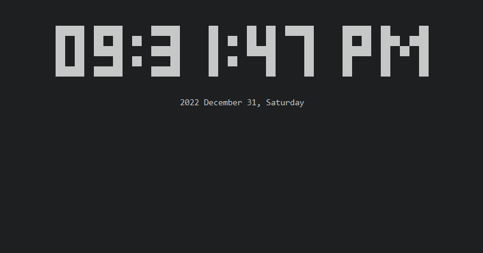

# Clock

## About

It's a clock. Literally.



## Installation

> Note: This project will require you to have the ***LTS*** version of [Node.js](https://nodejs.org/en/download/) installed.

First, since this project is completely written in [TypeScript](https://www.typescriptlang.org/), please install TypeScript on your system using the following command:

```
npm install -g typescript
```

Next, install all of the necessary packages for this project by using the following command: 

```
npm install
```

Finally, run the program using the following command:

```
npm start
```

## Usage

Press `ctrl + c` to exit the program at any time. I hope you enjoy it!

If you are using Windows or Linux, you can also press `m` to turn on the audio.

## Credits

Me.

( ^ v ^ )